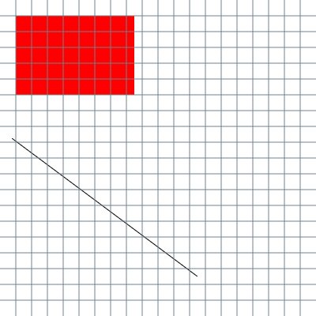

[Home](../README.md)

# Part 1

## Setting up Canvas and Drawing the Grid

Before we can do any drawing, we have to set up the canvas. Inside designs.js, we're going to first grab the canvas and then set up the context of the canvas.

The first line should be familiar to you:

```javascript
const canvas = document.getElementById("pixelCavas");
```

The second line of code is a little complicated. 

```javascript
const ctx = canvas.getContext("2d");
```

It returns an object for the canvas complete with the properties and methods that you will need for drawing on the canvas. For more information, you can either go to [MDN](https://developer.mozilla.org/en-US/docs/Web/API/HTMLCanvasElement/getContext) OR [W3Schools](https://www.w3schools.com/tags/ref_canvas.asp).

So now that we have the canvas set up, we can start drawing on it. The first two thing I'm going to show you how to do is change the fill color and draw a rectangle.

In order to change the fill color of the canvas, we simply use the "fillStyle" method.

```javascript
ctx.fillStyle = "red";
```

*Note: I like using red to test stuff becasue it really stands out, especially if you have mostly neutral colors in your design. It's also really easy to type.*

The rectangle is also rather simple:

```javascript
ctx.fillRect(20, 20, 150, 100);
```

The first number is the x-coordinate of the rectangle, the second is the y-coordinate, the third is the width, and the fourth is the height.

Drawing a line is a little bit more complicated.

First, let’s determine what the color of the line is going to be, using strokeStyle. I’m going with a nice, classic blue;

```javascript
ctx.strokeStyle = “blue”;
```

After that, to do is begin the path. This lets the canvas know that we are ready to start drawing. Think of it as putting your pen down on the paper.

```javascript
ctx.beginPath();
```

Next, we need to tell the canvas which coordinates we want to start at. Why don’t we start right under our red square?

```javascript
ctx.moveTo(15, 175);
```

Now lets add the other coordinates:

ctx.lineTo(250, 350);

Okay, now that you have the coordinates for the square, you still need to tell the canvas to draw the line.

```javascript
ctx.stroke();
```

At this point, your canvas should look something like this:


Cool! Now, because drawing a grid involves a lot of lines, it might not be a bad idea to wrap this code into a function.

```javascript
function drawLine(x1, y1, x2, y2){
   ctx.beginPath();
   ctx.moveTo(x1, y1);
   ctx.lineTo(x2, y2);
   ctx.stroke();
}

drawLine(15, 175, 250, 350);
```

And your picture should look exactly the same. Once you can draw one line, you can draw many lines. And if you can draw many lines, you can draw a grid.

It's a simple as using a couple of for loops. Since our canvas is 400x400, and 20 is the square root of 400, we'll use that for the dimensions of the grid. We can access the width and height of the cavas using canvas.height and canvas.width, respectively.

```javascript
for(let i = 20; i < canvas.width; i+= 20){
    drawLine(i, 0, i, canvas.height);
}

for(let i = 20; i < canvas.height; i+= 20){
    drawLine(0, i, canvas.width, i);
}
```

From here, we can customize the grid by setting up variables and plugging them into our code. Because we'll be adding inputs later that will determine how many cells across and down our grid is going to go, let's start with those.

```javascript

    let numRows = 20;
    let numCols = 20;

```

In order to determine how wide and how tall each cell is going to be, we need to divide the nums of rows and columns by the width and height of the canvas. So we don't have to access the canvas every time a loop iterates, I am also going to store them in variables.

```javascript

    let canvasWidth = canvas.width;
    let canvasHeight = canvas.height;
    let width = canvasWidth / numCols;
    let height = canvasHeight / numRow;

```

With these variables in place, it's not that hard to modify our loops to be both more versitile and efficient.

```javascript
    for(let i = width; i < canvasWidth; i+= width){
        drawLine(i, 0, i, canvasHeight);
    }

    for(let i = height; i < canvasHeight; i+= height){
        drawLine(0, i, canvasWidth, i);
    }
```


From here, we can wrap all this code into a neat little function...

```javascript
    function makeGrid(numCols, numRows){
        let canvasWidth = canvas.width;
        let canvasHeight = canvas.height;
        let width = canvasWidth / numCols;
        let height = canvasHeight / numRow;

        for(let i = width; i < canvasWidth; i+= width){
            drawLine(i, 0, i, canvasHeight);
        }

        for(let i = height; i < canvasHeight; i+= height){
            drawLine(0, i, canvasWidth, i);
        }
    }

```

Now, if you want to be able to change the color of the grid, all we have to do is add it as a third parameter.

```javascript
    function makeGrid(numCols, numRows, color){
        ctx.strokeStyle = color || "black"; //I added the last part just in
        let canvasWidth = canvas.width;
        let canvasHeight = canvas.height;
        let width = canvasWidth / numCols;
        let height = canvasHeight / numRow;

        for(let i = width; i < canvasWidth; i+= width){
            drawLine(i, 0, i, canvasHeight);
        }

        for(let i = height; i < canvasHeight; i+= height){
            drawLine(0, i, canvasWidth, i);
        }
    }

    makeGrid(20, 20, "slateGray");

```

Right now, your canvas should look like this...

